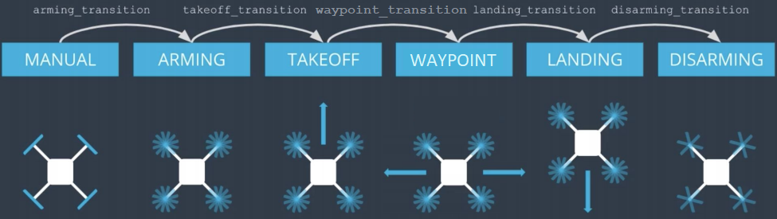
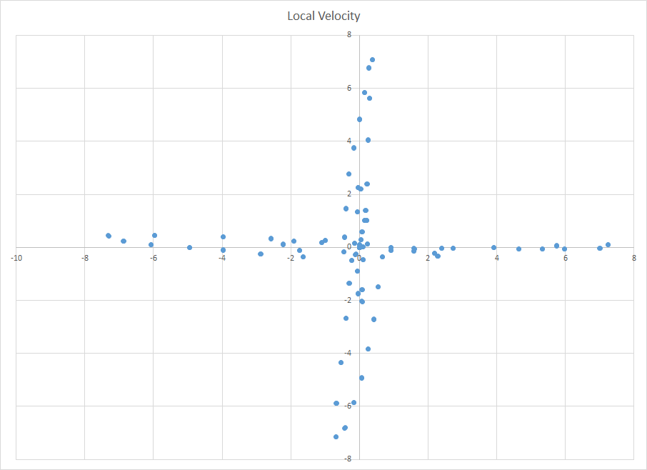

# FCND - Backyard Flyer Project
Set up a state machine using event-driven programming to autonomously fly a quadcopter in Unity simulator.

## Usage:

1. Open simulator, and choose "backyard flyer".

2. Open a miniconda terminal.

3. Navigate to project folder.

4. Activate appropriate environment (e.g. ```activate fcnd```)

5. Run: ```python backyard_flyer.py```

## The Code:

The event driven based code is structure as below:



The drone starts with manual state, and the drone is armed and taking over control.  Next, the drone will go into takeoff state where a target altitude is given.

When the drone is close to the target altitude, the state will be swtiched to waypoint state where the drone follows specified waypoints one by one.

When the drone is close to each target waypoint, local position and velocity are checked before next target waypoint is set.

When the drone is close to the last waypoint, state is switched to landing, and when landing has achieved, the drone is disarmed and control goes back to manual.

## Result:

Below shows the local x and y position plot of the drone.  One can see that the drone followed the sqaure (10 x 10 m) nicely, except overshoots at each waypoint.  Local position and velocity were checked before next target waypoint is set to avoid carrying sideway momentum in the next motion.

The drone landed within 1m of where it started.  Before the local velocity check was implemented, the landing location would overshoot because of leftover momentum from previous motion was carried over to the landing state.  Also, the sqaure plot would be distorted.

Final Position Plot


Distorted Position Plot


Below is a plot of drone's local velocity.  As expected, it is very close to a cross.  Before the local velocity check was implemented, the cross would be distorted as well.

Final Velocity Plot


Distorted Velocity Plot

